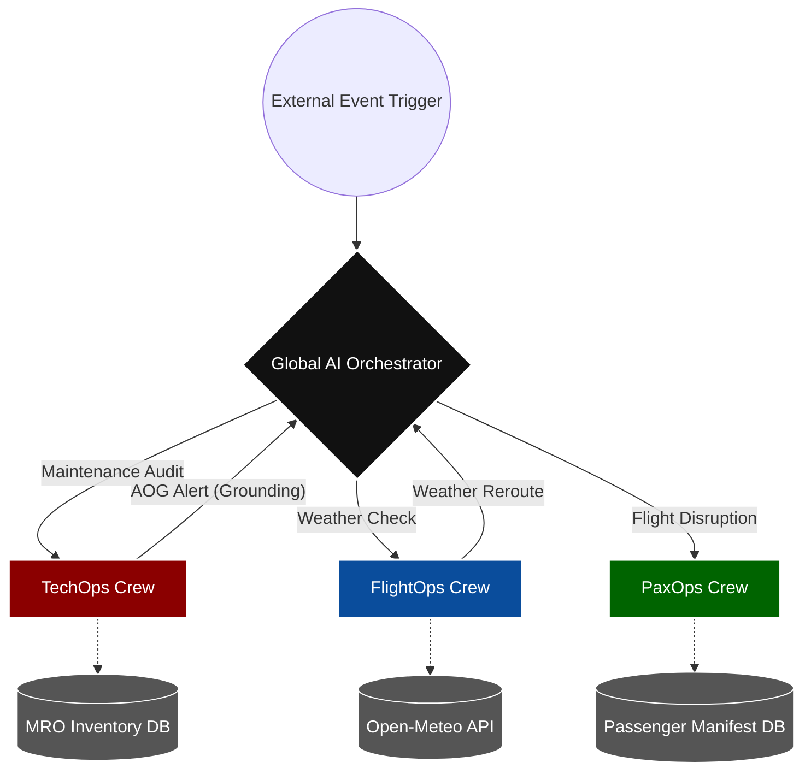

✈️ Airline Operational AI Hub
Enterprise-Grade Multi-Agent Orchestration for Aviation Compliance & Operations

🚀 Platform Overview
The Airline Operational AI Hub is a modular, agentic platform designed to bridge the gap between legacy operational data and modern automated decision-making. By leveraging a hub-and-spoke multi-agent architecture, the platform automates complex regulatory compliance, maintenance auditing, and operational workflows while maintaining strict Human-in-the-Loop (HITL) governance.

 ## 🏗️ Enterprise Multi-Agent Hub Architecture

🏗️ Domain Architecture
The platform is organized into autonomous, domain-specific "Crews" orchestrated by a central hub:

TechOps Crew: Automates dispatch compliance by cross-referencing flight plans against real-time avionics registries.

FlightOps Crew: AI-driven weather analysis, turbulence avoidance, and dynamic routing.

PaxOps Crew: Intelligent passenger ticketing, rebooking, and personalized disruption management.

📂 Repository Structure
Plaintext
airline-operational-ai-hub/
├── main_orchestrator.py      # Global execution & domain routing
├── crews/
│   ├── tech_ops/             # Automated Compliance & Dispatch
│   ├── flight_ops/ 
│   └── pax_ops/  
├── data/                     # Source telemetry & registry assets
├── requirements.txt          # Dependency manifest
└── .gitignore                # Security & environment exclusions

🚀 Deployment Guide
Clone the repository:

git clone [https://github.com/laxmitesting/aviation-multiagent-system.git](https://github.com/laxmitesting/aviation-multiagent-system.git)

 **Environment Setup:**
   Create a `.env` file in the root with your credentials:

  