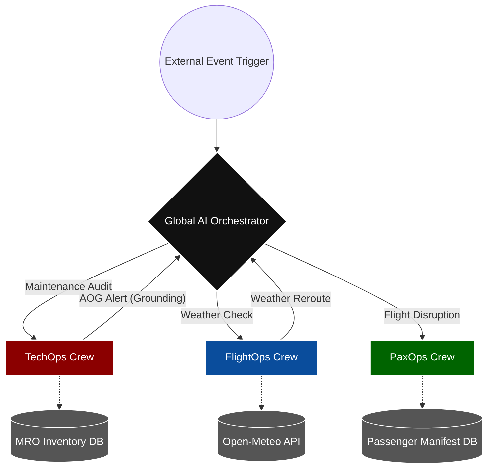

✈️ Airline Operational AI Hub
Enterprise-Grade Multi-Agent Orchestration for Aviation Compliance & Operations

🚀 Platform Overview
The Airline Operational AI Hub is a modular, agentic platform designed to bridge the gap between legacy operational data and modern automated decision-making. By leveraging a hub-and-spoke multi-agent architecture, the platform automates complex regulatory compliance, maintenance auditing, and operational workflows while maintaining strict Human-in-the-Loop (HITL) governance.

 ## 🏗️ Enterprise Multi-Agent Hub Architecture

📂 Repository Structure
Plaintext
airline-operational-ai-hub/
├── assets/                 # Workflow architecture diagrams
├── crews/
│   ├── tech_ops/           # Maintenance compliance & audit logic
│   ├── flight_ops/         # Weather-based hazard analysis
│   └── pax_ops/            # Passenger rebooking & compensation
├── data/                   # Mock telemetry & registry assets
├── utils/                  # Centralized LLM configuration (DRY Principle)
├── main_orchestrator.py    # Global API gateway for domain routing
└── requirements.txt        # Dependency manifest

🚀 Key Domain Capabilities
⚙️ TechOps (Maintenance Compliance)
Purpose: Automates FAA/ICAO equipment code audits.

Workflow: Ingests telemetry logs → Cross-references registry Truth → Flags non-compliance for human authorization.

🌤️ FlightOps (Weather & Routing)
Purpose: Dynamic hazard evaluation for flight dispatch.

Workflow: Pings real-time Open-Meteo data → Evaluates hazards against specific aircraft thresholds → Triggers REROUTE/DELAY.

👥 PaxOps (Disruption Recovery)
Purpose: Downstream customer recovery.

Workflow: Cascades from disruption events → Triages passenger manifest (VIPs/Minors) → Generates recovery/compensation plans.

🛠️ Tech Stack
Orchestration: CrewAI

LLM Engine: OpenAI gpt-5.4-mini

Architecture: Event-Driven, Modular, Multi-Agent Hub

Testing: Domain-isolated unit tests for every agent crew.

🚀 Quick Start
Clone the repository.
Set up your environment: Create a .env file in the root directory:
Plaintext-
OPENAI_API_KEY=your_key_here

Run the orchestrator:
Bash -
python main_orchestrator.py

🧪 Testing Methodology
Every domain crew includes an Isolated Test Harness. This allows for granular debugging of agents without triggering the full global orchestrator.

TechOps: Run python test-maintenance.py to validate batch telemetry processing and registry audits.

FlightOps: Run python test-weather.py to simulate live weather payload injection and hazard routing.

PaxOps: Run python test-pax.py to test downstream recovery logic from flight disruption events.

These isolated modules ensure that individual agent reasoning is robust before being integrated into the global operational workflow.
